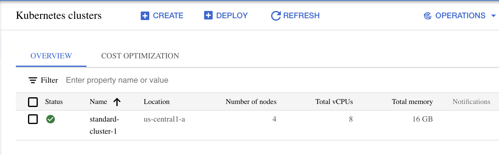

# Deploy Google Kubernetes Engine

## Overview

Use the Google Cloud Console to build GKE clusters and deploy a sample Pod.

## Objectives

Learn how to perform the following tasks:

* Use the Google Cloud Console to build and manipulate GKE clusters

* Use the Google Cloud Console to deploy a Pod

* Use the Google Cloud Console to examine the cluster and Pods

## Task 0: Lab Setup

To follow on with this lab, you need a Google Cloud Platform (GCP) account. You can sign up for a free account with a gmail account. It provides 90 days free trial or $300 funding, whichever finishes first.

* To sign up for a free account, use the link below:

* https://cloud.google.com/free/docs/gcp-free-tier/#free-trial

* It will ask for card details and address to validate the account. After that, the account will have a fee $300 credit.

## Task 1: Deploy GKE Clusters

In this task, use the Google Cloud Console and Cloud Shell to deploy GKE

1. In the Google Cloud Console, on the Navigation menu click **Kubernetes Enginge > Clusters**

2. Click **Create** to begin creating a GKE cluster. In the **GKE Standard** cluster option select **configure** in the next screen.

3. Examine the console UI and the controls to change the cluster name, the cluster location, Kubernetes version, the number of nodes, and the node resources such as the machine type in the default node pool.

4. Change the cluster name to **standard-cluster-1** and zone to **us-central1-a**. Leave all the values at their defaults and click **Create**.
The cluster begins provisioning.

When provisioning is complete, the Kubernetes Engine > Clusters page looks like the screenshot:

5. Click the cluster name standard-cluster-1 to view the cluster details

6. Scroll down the page to view more details.

7. Click the Storage and Nodes tabs under the cluster name (standard-cluster-1) at the top to view more of the cluster details.

## Task 2: Modify GKE clusters

It is easy to modify many of the parameters of existing clusters using either the Google Cloud Console or Cloud Shell. In this task, you use the Google Cloud Console to modify the size of GKE clusters.

1. In the Google Cloud Console, click **NODES** at the top of the details page for **standard-cluster-1**.

2. In **Node Pools** section, click **default-pool**.

3. In the Google Cloud Console, click **RESIZE** at the top of the **Node Pool Details** page.

4. Change the number of nodes from 3 to 4 and click **RESIZE**.

In the Google Cloud Console, on the **Navigation menu**, click **Kubernetes Enginge > Clusters**

When the operation completes, the **Kubernetes Engine > Clusters** page should show that standard-cluster-1 now has four nodes.

## Task 3. Deploy a sample workload

In this task, using the Google Cloud console, deploy a Pod running the nginx web server as a sample workload.

1. In the Google Cloud Console, on the **Navigation menu**, click **Kubernetes Engine > Workloads**.

2. Click Deploy to show the Create a deployment wizard.

3. Click Continue to accept the default container image, nginx:latest, which deploys 3 Pods each with a single container running the latest version of nginx.

4. Scroll to the bottom of the window and click the Deploy button leaving the Configuration details at the defaults.

5. When the deployment completes your screen will refresh to show the details of your new nginx deployment.

## Task 4. View details about workloads in the Google Cloud Console

In this task, view details of the GKE workloads directly in the Google Cloud Console.

1. In the Google Cloud Console, on the Navigation menu (Navigation menu), click Kubernetes Engine > Workloads.

2. In the Google Cloud Console, on the **Kubernetes Engine > Workloads** page, click **nginx-1**.
You may see Pods (3/3) as the default deployment will start with three pods but will scale back to 1 after a few minutes. You can continue with the lab.
This displays the overview information for the workload showing details like resource utilization charts, links to logs, and details of the Pods associated with this workload.

3. In the Google Cloud Console, click the Details tab for the nginx-1 workload. The Details tab shows more details about the workload including the Pod specification, number and status of Pod replicas and details about the horizontal Pod autoscaler.

4. Click the Revision History tab. This displays a list of the revisions that have been made to this workload.

5. Click the Events tab. This tab lists events associated with this workload.

6. And then the YAML tab. This tab provides the complete YAML file that defines this components and full configuration of this sample workload.

7. Still in the Google Cloud Console's **Details** tab for the **nginx-1** workload, click the Overview tab, scroll down to the **Managed Pods** section and click the name of one of the Pods to view the details page for that Pod.

8. In the Pod details page, you can click the Events and Logs tabs to view event details and links to container logs in Cloud Operations.

## End the Lab
After the lab completes:

1. In the Google Cloud Console, on the **Navigation menu**, click **Kubernetes Enginge > Clusters**. Select the checkbox for standard-cluster-1 and click **Delete** on the menu bar. Confirm the delete operation in the pop up window by typing the cluster name

### Prepared by:

---
Calistus Igwilo

ebunilo@yahoo.com

https://github.com/calistus-igwilo

https://linkedin.com/in/calistus-igwilo

